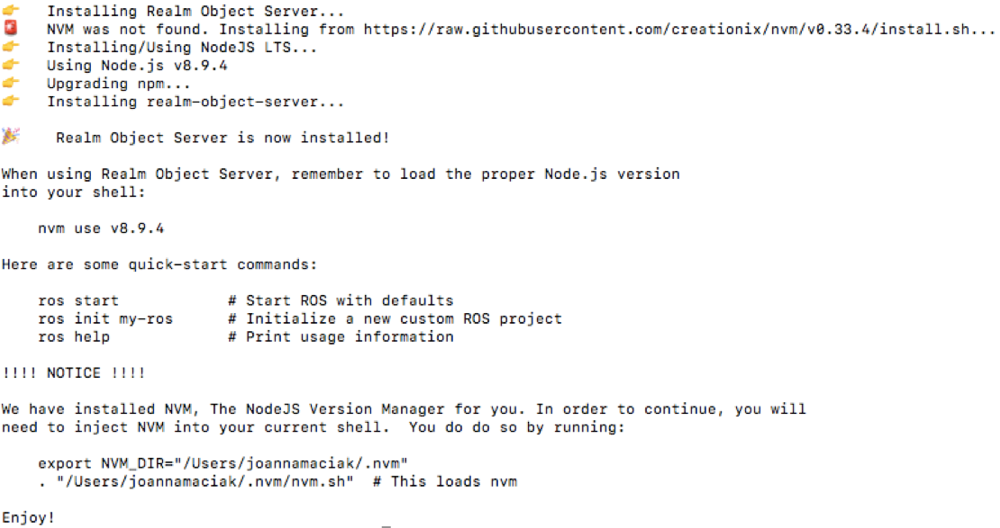
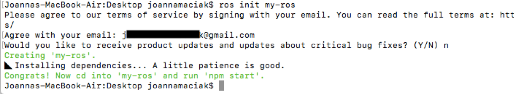
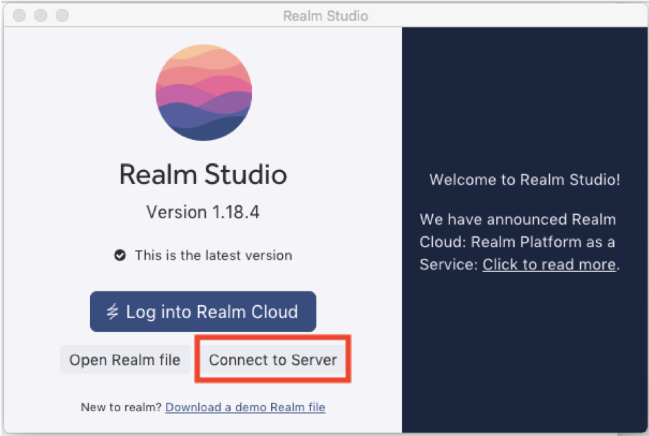
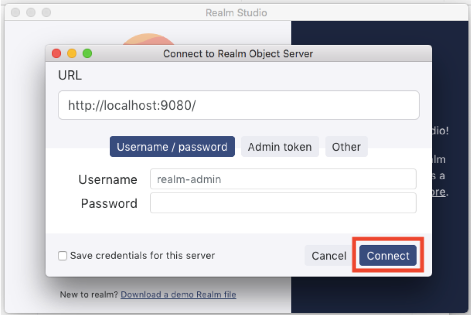
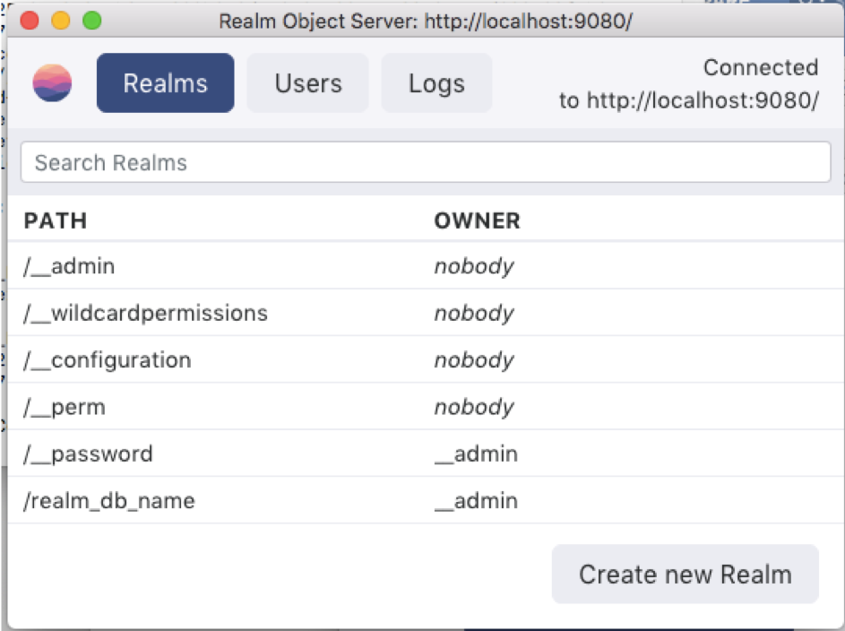

# [How to prepare project](http://georgeosddev.github.com/markdown-edit)

Before running project in Android Studio, you will need to go through steps below.

## 1.	Install Realm Object Server using instructions contained at the [ROS documentation website](https://realm.io/docs/realm-object-server/latest/)

*	Open terminal
*	Go to location you want to install Realm Object server
```bash
cd Desktop
```
*	Use command
```bash
curl -s https://raw.githubusercontent.com/realm/realm-object-server/master/install.sh | bash
```
You should get something like this: <br>
 
 
* Load the proper Node.js version into your shell:
 ```bash 
 nvm use v8.9.4
 ```

* Initialize Realm Object Server
```bash
init my-ros
```
Then provide two answers: <br>
 
 
 ## 2.	If you have installed Realm Object Server, there should appear a directory named my-ros. Go to my-ros/src and modify file index.ts following way:
 
 *	Replace index.ts file's content with :<br>
```ts
import { BasicServer } from 'realm-object-server'
import * as path from 'path'

const server = new BasicServer()

server.start({
        // This is the location where ROS will store its runtime data
        dataPath: path.join(__dirname, '../data'),
    })
    .then(() => {
        return server.ensureRealmExists('/realm_db_name')
    })
    .then(() => {
        server.applyPermissions({ userId: '*' }, '/realm_db_name', 'write')
    })
    .then(() => {
        console.log(`Realm Object Server was started on ${server.address}`)
    })
    .catch(err => {
        console.error(`Error starting Realm Object Server: ${err.message}`)
    })
```
Where <b> realm_db_name </b> is your own Realm Database's name.

*	Save changes.
*	Using terminal, go to <b> my-ros </b> and run Realm Object Server:
```bash
cd my-ros
npm start
```
## 3.	Install Realm Studio (you will be able to manage Realm Databases, Users and Realm Objects).
*	Download and install Realm Studio from the [ROS documentation website](https://realm.io/docs/realm-object-server/latest/)
* Scroll down to the <b> Realm Studio </b> section and find Realm Studio for your Operating System<br>


## 4.	Show Realms list
* Run <b>Realm Studio</b>
*	Select <b>Connect to Server</b> option <br>
 <br>
*	Click <b>Connect</b> button <br>
<br>
There should appear list of Realms like this one:
<br>

## 5.	Modify DbConnector java class file before running project.

*	Open <b>new  terminal tab </b> and check your IP address using command (for Mac OS):
```bash 
ifconfig
```
or for Windows:
```bash
ipconfig
```
*	Go to <b>AppInz/app/src/main/java/com/example/asia/jmpro/data</b> and 
change values of <b>PRIVATE_REALM_URL</b>, <b>AUTH_URL</b> and <b>REALM_URL</b> following way:
```java
private static final String PRIVATE_REALM_URL = "realm://your_IP_address:9080/~/realm_db_name";
private static final String AUTH_URL = "http://your_IP_address:9080/auth";
private static final String REALM_URL = "realm://your_IP_address:9080/realm_db_name";
```
* Save changes
* Run project and see how it works :)
